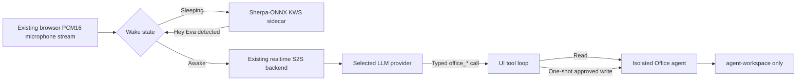

# Optional Wake Word And Office Agent

These capabilities are isolated additions to the existing modular STT, LLM,
TTS, memory, MCP, and visual-observer paths. Both are disabled by default. If a
sidecar is stopped or its feature flag is `0`, normal voice chat continues
without it.

## Architecture



The browser reaches both services only through same-origin UI endpoints. The
sidecars have no host ports and share an internal Docker network with the UI.

## Wake Word

The detector uses CPU-only `sherpa-onnx==1.13.4` and the int8
`sherpa-onnx-kws-zipformer-gigaspeech-3.3M-2024-01-01` model. Sherpa's custom
keyword format provides phrase selection without training another model. This
avoids adding RealtimeSTT's second transcription pipeline to the existing STT
stack. RealtimeSTT and Meetily are references only and are not runtime
dependencies.

Pinned model archive:

```text
https://github.com/k2-fsa/sherpa-onnx/releases/download/kws-models/sherpa-onnx-kws-zipformer-gigaspeech-3.3M-2024-01-01.tar.bz2
SHA-256 f170013b4716e41b62b9bfd809687c207cef798ef9bc6534d524e17af9b6561a
```

Configuration:

```env
WAKE_WORD_ENABLED=0
WAKE_WORD_BASE_URL=http://wake-word:8081
WAKE_WORD_PHRASE=HEY EVA
WAKE_WORD_SCORE=2.5
WAKE_WORD_THRESHOLD=0.10
WAKE_WORD_FOLLOWUP_S=60
WAKE_WORD_NUM_THREADS=1
WAKE_WORD_REQUIRE_LOCAL=1
```

After validation, enable and start it with:

```powershell
docker compose --env-file .env -f docker-compose.local.yml --profile wake-word up -d --build wake-word ui
```

The UI states are `Off`, `Sleeping`, `Heard Hey Eva`, `Awake`, and
`Unavailable`. Sleeping PCM goes only to keyword spotting. After detection, a
short local acknowledgement plays and subsequent PCM enters the existing S2S
socket. The session stays awake for 60 seconds after the latest completed user,
assistant, or tool turn and never sleeps during an active response. The visible
Sleep control immediately blocks S2S audio. If KWS disconnects, the gate fails
closed; pressing the main orb permits one manual turn.

### Acceptance Gate

Do not set `WAKE_WORD_ENABLED=1` as a default until a microphone corpus from the
target rooms passes all of these checks:

| Corpus | Required result |
|---|---|
| At least 30 natural `Hey Eva` recordings across speakers, distances, and noise levels | At least 90% detected |
| At least two hours of representative room, TV, music, and conversation audio without the phrase | No more than 0.5 false triggers per hour |
| Positive recordings measured from phrase end to acknowledgement | p95 no more than 700 ms |

The automated tests cover routing, timeout, manual fallback, and fail-closed
behavior. A synthetic Windows voice smoke test detected the phrase, but that is
not a substitute for the acceptance corpus.

Reference: [Sherpa-ONNX keyword spotting documentation](https://k2-fsa.github.io/sherpa/onnx/kws/index.html).

## Local Office Agent

The Office sidecar wraps a pinned OfficeCLI binary with first-party typed HTTP
operations. The model never receives OfficeCLI's raw command-string MCP tool.
Only these model tools are registered: `office_list`, `office_inspect`,
`office_render`, `office_validate`, and `office_apply`.

Pinned release checksums:

| Asset | SHA-256 |
|---|---|
| OfficeCLI `v1.0.135` `SHA256SUMS` | `9a991e1db05c6c6896c6747c76d833735f0b907648cb1a416f80f1840999a3d5` |
| `officecli-linux-x64` | `00028af3db48678fc9ff6c8f9e70fa4c150dcee2b43ed85254afc8f4a48e13eb` |
| `officecli-linux-arm64` | `2ec0d5a455646647f798f723e62fd9c18e2e801f8460d4401d2554a6a1c6d5b0` |

Generate a private service token, put it in `.env`, and enable the profile:

```powershell
$bytes = New-Object byte[] 32
[Security.Cryptography.RandomNumberGenerator]::Create().GetBytes($bytes)
[BitConverter]::ToString($bytes).Replace('-', '').ToLowerInvariant()
```

```env
OFFICE_AGENT_ENABLED=1
OFFICE_AGENT_BASE_URL=http://office-agent:8082
OFFICE_AGENT_TOKEN=<generated-random-token>
OFFICE_AGENT_REQUIRE_LOCAL=1
OFFICE_AGENT_REQUIRE_LOCAL_LLM=1
OFFICE_AGENT_LOCAL_LLM_PROVIDERS=lmstudio
OFFICE_AGENT_WORKSPACE=./agent-workspace
OFFICE_AGENT_INTENT_TTL_S=60
OFFICE_AGENT_TIMEOUT_S=35
```

```powershell
docker compose --env-file .env -f docker-compose.local.yml --profile office-agent up -d --build office-agent ui
```

Place documents in `agent-workspace/`. Git ignores its contents. Paths are
normalized inside that directory; absolute paths, traversal, escaping symlinks,
unsupported extensions, and arbitrary commands are rejected. Reads accept
Office, CSV, JSON, and image files for listing, while OfficeCLI document
inspection and mutation are limited to `.docx`, `.xlsx`, and `.pptx`.

Every `office_apply` call creates a server-side intent bound to the normalized
request and a request ID. The UI shows the exact file and operation. Approval is
one-shot and expires after 60 seconds; rejection, timeout, disconnect, and
replay cancel execution. A turn is limited to six Office tool rounds, two
mutations, 120 seconds, and one concurrent write.

Writes run on a temporary copy. The sidecar validates that copy, stores a
backup, commits it, compares the committed bytes with the validated copy, and
validates the final path again. A failed commit restores the prior bytes.
OfficeCLI lint suggestions remain visible but do not incorrectly roll back a
document that passes structural validation.

Raw operations including `raw`, `raw-set`, `watch`, `plugins`, `install`,
`config`, and `mcp` are blocked. The container runs as UID 10001 with a
read-only root filesystem, all Linux capabilities dropped, `no-new-privileges`,
tmpfs scratch space, no Docker socket, no home-directory mount, no host port,
and an internal-only network.

Reference: [OfficeCLI command MCP documentation](https://github.com/iOfficeAI/OfficeCLI/wiki/command-mcp).

## Resource Envelope

Measured idle values on the reference Windows Docker Desktop host:

| Sidecar | Image size | Idle memory | Compose limit |
|---|---:|---:|---:|
| Wake word | about 111 MiB | about 77 MiB | 256 MiB, 1 CPU |
| Office agent | about 311 MiB | about 35 MiB | 2 GiB, 2 CPUs |

Office rendering launches Chromium and can temporarily use substantially more
memory than its idle value. Neither sidecar consumes GPU memory.

## Rollback

Set both feature flags to `0`, recreate the UI, and stop the optional services:

```powershell
docker compose --env-file .env -f docker-compose.local.yml up -d --build ui
docker compose --env-file .env -f docker-compose.local.yml stop wake-word office-agent
docker compose --env-file .env -f docker-compose.local.yml rm -f wake-word office-agent
```

This restores the previous browser-to-S2S path. It does not modify speech
backend selection, STT, LLM routing, TTS, MCP memory, or SmolVLM. Office
documents and backups remain under `agent-workspace/` until explicitly removed.
